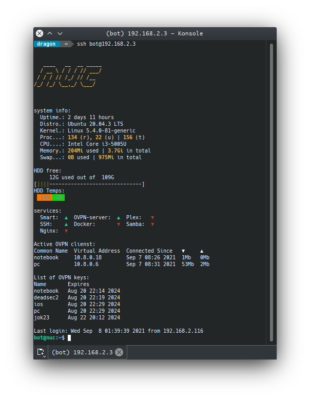

# MOTD

This repository contains the my configs for MOTD forked from [yboetz](https://github.com/yboetz/motd).

It just Messange Of The Day for linux ssh and terminal.

# Requirements
 * update-motd
   - Needed for work all scripts
 * figlet
   - Needed for work displayname in module 10-display-name
 * hddtemp
   - Needed for showing temp in module 30-hdd-temp
 * docker
   - Needed for working module 60-docker
 * lxd
   - Needed for working module 60-lxd

# Screenshot


# Installing
1. In /etc/ssh/sshd_config need to set up string to `PrintMotd yes`
2. Install `update-motd`
3. 
```
git clone https://github.com/RIKRUS/MOTD.git
cd MOTD
sudo chown root:root *
sudo cp * /etc/update-motd.d/
sudo update-motd
```
